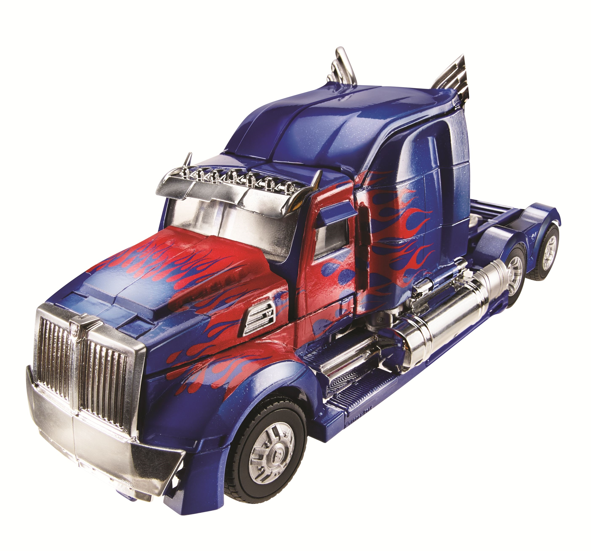
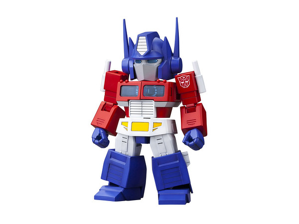
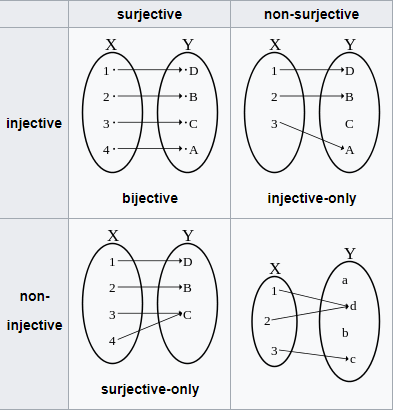
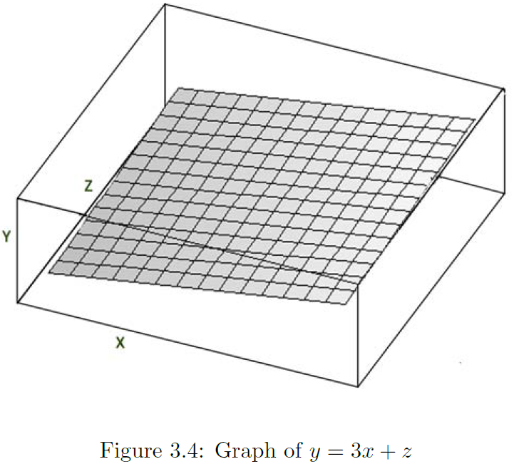
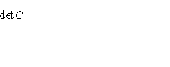
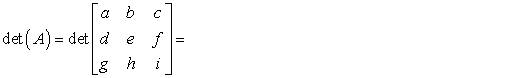

```{r setup, include = FALSE}
knitr::opts_chunk$set(message = FALSE, warning = FALSE)

library(pacman)
p_load(dotwhisker, ggplot2, interplot, # Visualization
       ordinal, RefManageR,# Applied
       # dependency
       readxl, haven, descr, stringi, stringr, arm, car, stargazer, data.table,
       broom, tidyverse) # data wrangling

set.seed(313)
```

# Preface
## Who Am I?

* Ph.D. candidate in Department of Political Science
* Research area: 
    + Comparative politics, methodology, and international relations. 
    + Substantive: language policy, political communication, and public opinion. 
    + Methodology: 
        + Survey experiments
        + Quantitative methods
* Homepage: https://sammo3182.github.io/.

## What Shall We Do?
* Today 
    + Functions
* Tomorrow
    + Linear algebra (10:00 - 12:00)
    + Calculus:　Differential (13:30 - 15:30)

## Anxious about Math?

<iframe width="560" height="300" src="https://www.youtube.com/embed/7snnRaC4t5c?ecver=1" frameborder="0" allowfullscreen></iframe>


## Ready?

<div class="centered">

</div>

# Function

## What's a Function?

* Definition: "A relation that assigns one element of the range to each element of the domain (Moore & Siegel 2013, 45)"
    + $Y = f(X).$
    + X: domain
    + Y: codomain

## Human language: A rule of transforming
* Domain: <br><br><div class="centered"></div>
* Codomain: <br><br><div class="centered"></div>

----

* Function: <br><br><div class="centered"></div>


## Express a Function
* Equation: 
    + Implicit function: $y = f(X) = 1 - x^2.$
        + y is a function of x
            + Image/range.
        + x: <span style="color:yellow">Argument</span>.
        + f: <span style="color:yellow">Mapping</span>.
            + *We map the values of Y for any given set of X values.*
            + *f maps A into B.*
    + Explicit function: $y = 1 - x^2.$
    + Function composition: $g(f(x))$, "g composed with f."
* Graph: https://www.desmos.com/calculator

## Properties

* A function is <span style="color:yellow">surjective</span> or <span style="color:yellow">onto</span> if every value in the codomain is produced by some value in the domain.
* A function is <span style="color:yellow">injective</span> or <span style="color:yellow">one-to-one</span> if each value in the range comes from
only one value in the domain.
* If a function is both injective and surjective (one-to-one and onto), then it
is <span style="color:yellow">bijective</span>.
    + A bijective function is invertible, viz. having an inverse.

----

<div class="centered"></div>


## Properities (Continued)

* Identity function: $f(x) = x.$
* Inverse function: 
$$
\begin{align}
f(x) =& 2x + 3;\\
f^{-1}(x) =& \frac{x - 3}{2}.
\end{align}
$$

* $f(f^{-1}(x)) = ?$
    + x.
* $f^{-1}(f(x)) = ?$
    + x.


## Monotonic Functions

* Increasing vs. Decreasing
* Strictly increasing vs. striticly decreasing
    + "A strictly monotonic function is strictly increasing over its entire domain (Moore & Siegel 2013, 50)." 
    + A function is monotonic if its first derivative does not change sign.
* Weakly increasing vs. Weakly decreasing
    + Not decreasing
    + Not increasing

## Functions with More than One Argument

$$y = 3xz.$$
<div class="centered"></div>

## A Special Multi-Argument Function: Interaction

$$Y = \beta_1Weight + \beta_2Cylinders + \beta_3Weight\times Cylinders.$$
```{r interaction, echo = FALSE}


data("mtcars")
m_cyl <- lm(mpg ~ wt * cyl, data = mtcars)

interplot(m = m_cyl, var1 = "cyl", var2 = "wt") + 
  # Add labels for X and Y axes
    xlab("Automobile Weight (thousands lbs)") +
    ylab("Estimated Coefficient for\nNumber of Cylinders") +
  # Change the background
    theme_bw() +
  # Add the title
    ggtitle("Estimated Coefficient of Engine Cylinders \non Mileage by Automobile Weight") +
    theme(plot.title = element_text(face="bold")) +
  # Add a horizontal line at y = 0
    geom_hline(yintercept = 0, linetype = "dashed")
```


## Linear function

$$y = ax + b.$$
* a: slope
* b: intercept.
* Properties:
    + Additivity (superposition): $f(x_1 + x_2) = f(x_1) + f(x_2).$
    + Scaling (homogeneity): $f(ax) = af(x).$

## Nonlinear function: Exponents
$$b^n = x.$$

* Exponential function is to solve for x.
    + e.g., $y = x^2.$
* Property: x is called the base.
    + Multiplication: m and n are constant.
        + $x^m + x^n = x^{m + n};$ 
        + $x^m * z^m = (xz)^m;$
        + $(x^m)^n = x^{mn}.$
        + $x^0 = 1.$
        
----
        
* Division
    + $\frac{x^m}{x^n} = x^{m - n};$ 
        + So what's $\frac{1}{x^n}$?
        + $x^{-n}.$
    + $\frac{x^m}{z^m} = (\frac{x}{z})^m.$
* Some terminology
    + Quadratic (parabola): $y = \beta_0 + \beta_1x + \beta_2x^2.$
    + Polynomial: 
    $$\begin{align}
    y =& \beta_0 + \beta_1x + \beta_2x^2 + \beta_3x^3 + ...\\
    y =& \sum_0^n\beta_nx^n.
    \end{align}$$

## Nonlinear function: Radicals
$$b^n = x.$$

* Radical function is to solve for b.
    + e.g., $y = \sqrt[n]{x} = x^{\frac{1}{n}}.$
* Properties
    + Multiplication: $\sqrt[n]{x}\times \sqrt[n]{z} = x^{\frac{1}{n}}\times z^{\frac{1}{n}} = (xz)^{\frac{1}{n}}.$
    + Division: $\frac{\sqrt[n]{x}}{\sqrt[n]{z}} = (\frac{x}{z})^{\frac{1}{n}}.$

## Nonlinear function: Logarithms
$$b^n = x.$$

* Logarithm function is to solve for n.
    + The inverse of exponential function (e.g., $y = e^x; y = 10^x$).
    + e.g., $y = ln(x); y = log(x).$
* Properties
    + $ln(1) = 0; log_a(a) = 1$
    + $ln(x_1\cdot x_2) = ln(x_1) + ln(x_2);$
    + $ln(\frac{x_1}{x_2}) = ln(x_1) - ln(x_2);$
        + NB: $ln(x_1\pm x_2)\neq ln(x_1)\pm ln(x_2).$
    + $ln(x^b) = bln(x).$

## Non-Functions or Functions
* Correspondence: "A relation that assigns a subset of the range to each element of the domain (Moore & Siegel 2013, 45)" (?)
*  In general mathematics, a correspondence is an ordered triple (X,Y,R), where R is a relation from X to Y, i.e. any subset of the Cartesian product X×Y.

## Let's Practice!
 
<div class="centered">

## Exercise I: Simplification
1. $x^{-2}\times x^3 = ?$
1. $(b\cdot b\cdot b)\times c^{-3} = ?$
1. $((qr)^\gamma)\delta = ?$
1. $\sqrt{x}\times \sqrt[5]{x} = ?$
1. $ln(3x) - 2ln(x + 2) = ?$
1. 
$$\begin{align}
f(x) =& x^2 + 2;\\
g(x) =& \sqrt{x - 4}.\\
h(x) =& g(f(x)) = ?
\end{align}$$


## Answers
1. $x^{-2}\times x^3 = x.$
1. $(b\cdot b\cdot b)\times c^{-3} = b^3c^{-3}.$
1. $((qr)^\gamma)^\delta = (qr)^{\gamma\delta}.$
1. $\sqrt{x}\times \sqrt[5]{x} = x^{\frac{7}{10}}.$
1. $ln(3x) - 2ln(x + 2) = ln(\frac{3x}{(x + 2)^2}).$
1. 
$$\begin{align}
f(x) =& x^2 + 2;\\
g(x) =& \sqrt{x - 4}.\\
h(x) =& g(f(x)) = \sqrt{x^2 - 2}.
\end{align}$$

## Exercise II: Graphing
1. $f_1(x) = x + 0.5.$
1. $f_2(x) = -\frac{x}{3} + \frac{1}{4}.$

## Answers
```{r functionPlots, echo = FALSE}
funPlot <- ggplot(data.frame(x = c(-1,1)), aes(x))

funPlot +
  stat_function(fun = function(x){x + .5}, aes(colour="f1"), geom = "line") +
  stat_function(fun = function(x){-x/3 + .25}, aes(colour="f2"), geom = "line") +
  geom_vline(xintercept = 0, linetype = "dashed") + 
  geom_hline(yintercept = 0, linetype = "dashed") +
  scale_colour_manual("Function", values=c("blue","red"), breaks=c("f1","f2"))


```

## Exercise III: Taking the Log
1. $y = \beta_0 + x_1^{\beta_1} + \beta_2x_2 + \beta_3x_3.$
1. $y = \beta_0\times x_1^{\beta_1}\times x_2^{\beta_2}\times x_3^{\beta_3}.$
1. $y = \beta_0\times x_1^{\beta_1}\times \frac{x_2^{\beta_2}}{x_3^{\beta_3}}.$

## Answers
1. $ln(y) = ln(\beta_0 + x_1^{\beta_1} + \beta_2x_2 + \beta_3x_3).$
1. $ln(y) = 1 + \beta_1ln(x1) + \beta_2ln(x2) + \beta_3ln(x3);$
1. $ln(y) = 1 + \beta_1ln(x1) + \beta_2ln(x2) - \beta_3ln(x3).$


# Call It the Day!

<div class="centered">

</div>


# Linear Algebra
## Why should we care? 
* As a methodologist,
    + Reading the method papers.
    + Spatial analyses, game theory, dynamic model, etc.

* As an empiricist,
    + Learning R.

* As a lazy guy,
    + $y = \beta_0 + \beta_1X_1 + \beta_2X_2 + ... + \beta_nX_n + \varepsilon$
    + $\boldsymbol{Y} = \boldsymbol{X\beta}$
    + And imagine if you have more than one $y$.


## Concept

* Scalar
    + 
    + Single element of a set.

----

* Vector
    + 
    + Force in physics
    + Dimension 

----

* Matrix
    + 
    
    
    
## Vector Algorithm
* Length

    \[||\boldsymbol{x}|| = \sqrt{\sum x_i^2}. \]

* What's this in the real life? 
    + right triangle.
    
* Example

    If $\boldsymbol{x} = (2, 4, 4, 1)$, its length $||\boldsymbol{x}|| = \sqrt{2^2 + 4^2 + 4^2 + 1^2} = \sqrt{37}$. 

----

* Addition

    \[\boldsymbol{a} \pm \boldsymbol{b} = (a_1 \pm b_1, a_2 \pm b_2, ..., a_n \pm b_n).\]
    
* What's this in the real life?
    + 
    
* Example: $(1,2) + (5,8) = (1 + 5, 2 + 8) = (6, 10).$

----

* Scalar Multiplication
    + \[c\boldsymbol{x} = (cx_1, cx_2,..., cx_n). \]
  
* What's this in the real life?
    + 

    
* Example: Let $\boldsymbol{x} = (2, 4), 2\boldsymbol{x} = (4,8).$ 

----

* Vector normalization
    + \[\frac{\boldsymbol{x}}{||\boldsymbol{x}||}\]

* Vector Multiplication 
    + Dot product: \[\boldsymbol{a\cdot b} = \sum a_ib_i = |\boldsymbol{a}||\boldsymbol{b}|cos\theta. \]


## Matrix in Types

+ **Column vector**: a matrix with only one column
+ **Row vector**: a matrix with only one row
+ **Scalar**: a matrix with only one element
+ **Square matrix**: $A_{2\times2} = \left(\begin{array}{cc} 
                  1 & 2\\
                  3 & 4
                  \end{array}\right)$
+ **Zero matrix**: $\left(\begin{array}{cc} 
                  0 & 0 & 0\\
                  0 & 0 & 0
                  \end{array}\right)$
+ **Diagonal matrix**: $\left(\begin{array}{cc} 
                  1 & 0 & 0\\
                  0 & 2 & 0\\
                  0 & 0 & 3
                  \end{array}\right)$                  

----

+ **Identity matrix **: $I = \left(\begin{array}{cc} 
                      1 & 0 & 0\\
                      0 & 1 & 0\\
                      0 & 0 & 1
                      \end{array}\right)$

+ **Permutation matrix **: $\left(\begin{array}{cc} 
                      0 & 1 & 0\\
                      1 & 0 & 0\\
                      0 & 0 & 1
                      \end{array}\right)$


+ **Upper/lower matrix**: $\left(\begin{array}{cc} 
                      1 & 4 & 5\\
                      0 & 2 & 6\\
                      0 & 0 & 3
                      \end{array}\right)$
                      
## Matrix Transposition{.column-2}
Row to column, $A^t$.

* How the changes perform?
    + Symmetric            |  Asymmetric
      :-------------------------:|:-------------------------:
        |  

## Matrix Addition
* $A \pm B = a_{ij} \pm b_{ij}$
* Example
    + $A = \left(\begin{array}{cc} 
                  1 & 2\\
                  3 & 4
                  \end{array}\right)$
    + $B = \left(\begin{array}{cc} 
                  5 & 6\\
                  7 & 8
                  \end{array}\right)$              
    + $A + B = \left(\begin{array}{cc} 
                  6 & 8\\
                  10 & 12
                  \end{array}\right)$

## Matrix Multiplication
* Scalar Multiplication: $cA = ca_{ij}.$
* Matrix Multiplication: $C_{n\times p} = A_{n\times m}B_{m\times p} = \sum_{k = i}^{m}a_{ik}b_{kj}.$
    +  <div class="centered">
    + Left-multyplying B by A means $BA$; right-multiplying B by A means $AB$.
    
----

* Kronecker Product: $A_{m\times n}\otimes B_{p\times q} = C_{mp\times nq}.$
    + 

## Determinant
* Used to convert the matrix into scalar.
* $2\times 2$ matrix (butterfly method)
    + 
* Laplace expansion: using minors.
    + 
* Mattices with non-zero determinant are **non-singular matrices**, which means invertible.

## Inverse
* If $AB = BA = I$, then B is the inverse of A, i.e., $B = A^{-1}$. Therefore, 
\[A\cdot A^{-1} = I.\]
* Calculate the inverse
    + Cofactor Matrix: $A_{ij} = (-1)^{i + j}M_{ij}$, where $M$ is the minor of $a_{ij}$.
    + Adjoint matrix: the matrix of cofactor matrices.
    + $A^{-1} = \frac{1}{|A|}adj(A)$
    + Example: Moore & Siegel 2013, pp.295-6.
    
## Properties
* Matrix
    + Associative: $(AB)C = A(BC)$.
    + Additive distributive: $(A + B)C = AB + BC$.
    + Scalar commutative: $xAB = (xA)B = A(xB) = ABx$
* Transpose
    + Inverse: $(A^T)^T = A$.
    + Additive: $(A + B)^T = A^T + B^T$.
    + Multiplicative: $(AB)^T = B^TA^T$.
    + Scalar multiplication: $(cA)^T = cA^T$.
    + Inverse transpose: $(A^{-1})^T = (A^T)^{-1}$.

----

* Determinant
    + Transpose: $det(A) = det(A^T)$.
    + Identity: $det(I) = 1$.
    + Multiplicative: $det(AB) = det(A)det(B)$.
    + Inverse: $det(A^{-1}) = \frac{1}{det(A)}$.
    + Scalar multiplicative: $det(cA_{n\times n}) = c^ndet(A)$.
* Inverse
    + Inverse: $(A^{-1})^{-1} = A$.
    + Multiplicative: $(AB)^{-1} = B^{-1}A^{-1}$.
    + Scalar multiplicative: $(cA)^{-1} = c^{-1}A^{-1}, \mbox{if}\ c\neq 0$.
    
    
## Exercise I
```{r}
library(dplyr)
a <- matrix(c(10, 2, 5, 2), ncol = 1)
b <- matrix(c(4, 15, 6, 8), ncol = 1)
c <- matrix(c(2, 6, 8), nrow = 1)
d <- matrix(c(1, 15, 12), nrow = 1)
e <- matrix(c(14, 17, 17, 11, 10), nrow = 1) %>% t
f <- matrix(c(20, 4, 10, 4), nrow = 1)
```

```{r eval=FALSE}
a + b
a + c
b - e
15 * c
-3 * f
norm(b, type = "F")
norm(c + d, type = "F")
norm(c - d, type = "F")
a %*% b
c %*% d
```

----

Answers
```{r}
a + b
#a + c
#b - e
15 * c
```

----

```{r}
-3 * f
norm(b, type = "F")
norm(c + d, type = "F")
```

----

```{r}
norm(c - d, type = "F")
#a %*% b
#c %*% d
```

## Exercise II
```{r}
A <- matrix(c(5, 1, 2, 6, 2, 3), nrow = 2)
B <- matrix(c(3, 4, 5, -2, -3, 6), nrow = 2)
C <- matrix(c(1, 2, -5, 3, -3, 1), ncol = 2)
D <- matrix(c(2, 1, 4, 3), nrow = 2)
```

```{r eval = F}
2 * B - 5 * A
t(B) - C
B %*% C
C %*% B
```

----

Answers: 
```{r}
2 * B - 5 * A
t(B) - C
```

----

```{r}
B %*% C
C %*% B
```


## Exercise III
```{r}
A <- matrix(c(2, 1, -2, 2), ncol = 2)
B <- matrix(c(3, 2, -4, -1, -5, 1, 3, 2, 3), ncol = 3)
```

```{r eval = F}
det(A)
det(B)
```

----

Answers: 
```{r}
det(A)
det(B)
```


## Exercise IV
```{r}
A <- matrix(c(4, 2, 6, 3), ncol = 2)
B <- matrix(c(1, 4, 3, 2), ncol = 2)
```

```{r eval = F}
solve(A)
solve(B)
```

----

Answers
```{r}
# solve(A)
solve(B)
1/det(B) * matrix(c(2, -3, -4, 1), nrow = 2)
```


# Differentiation
## Derivative
* Mathematic definition
    + 

* what's this in the geomatrics?
    + 

----

* What's this in the real life?
    + 
    
## Rules
* $(C)' = 0$.
* $(x^{\mu})' = \mu x^{\mu - 1}$.
* $(a^x)' = a^xln\ a$.
* $(log_ax)' = \frac{1}{xln\ a}$.
* Let u, v are derivable, 
    + $(u\pm v)' = u' \pm v'$.
    + $(Cu)' = Cu'$, where $C$ is constant.
    + $(uv)' = u'v + uv'$.
    + $(\frac{u}{v})' = \frac{u'v - uv'}{v^2},$ where $v\neq 0.$
    
----

* Chain rule: $g(f(x))' = g'(f(x))f'(x)$
    + To solve $g(f(x))'$, let $u = f(x)$.
    + $g(f(x))' = g(u)'u' = g(u)'f(x)'$

## Exercise I{.smaller}
1. $y = x^3 + \frac{7}{x^4} - \frac{2}{x} + 12$
    + $3x^2 - \frac{28}{x^5} + \frac{2}{x^2}$
1. $y = 5x^3 - 2^x + 3e^x$
    + $15x^2 - 2^xln\ 2 + 3e^x$
1. $y = x^2ln\ x$
    + $x(2ln\ x + 1)$
1. $y = \frac{ln\ x}{x}$
    + $\frac{1 - ln\ x}{x^2}$
1. $y = \frac{e^x}{x^2} + ln\ 3$
    + $\frac{e^x(x - 2)}{x^3}$

## Exercise II{.smaller}
1. $y = (2x + 5)^4$
    + $8(2x + 5)^3$
1. $y = e ^{-3x^2}$
    + $-6xe^{-3x^2}$
1. $y = ln(1 + x^2)$
    + $\frac{2x}{1 + x^2}$
1. $y = \sqrt{a^2 - x^2}$
    + $-\frac{x}{\sqrt{a^2 - x^2}}$
1. $y = \frac{ln\ x}{x^n}$
    + $\frac{1 - nln\ x}{x^{n + 1}}$
    
----


<div class="centered">

</div> 


